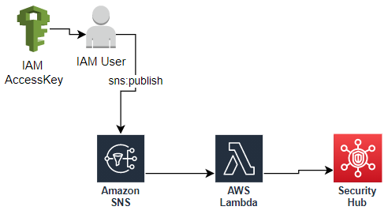

## Cloud One Workload Security custom integration with AWS Security Hub
This is an example of how to use the custom integrations of Security Hub, it is possible to send Workload Security events to Security Hub with the use of the SNS.

For this, it is necessary to have the following requirements:

> An active [Cloud One](https://cloudone.trendmicro.com/home) account.
> An [AWS account](https://aws.amazon.com/premiumsupport/knowledge-center/create-and-activate-aws-account/) where the Lambda, SNS and SecurityHub service will be used.

### Note:
This example requires that the AWS account be integrated in Workload Security with the use of the [Cloud Connector](https://cloudone.trendmicro.com/docs/workload-security/aws-add-quick/) and the Workload Security [agent installed](https://cloudone.trendmicro.com/docs/workload-security/aws-agent-install/) and [configured](https://cloudone.trendmicro.com/docs/workload-security/policy-create/) in the AWS instances.

## Deployments

 With Cloud Formation Template 
 
In this repository you will find a CloudFormation template which will create the following infrastructure.

When the template completes its creation in the Outputs you will find the necessary information to make the configuration in Cloud One Workload Security.
> SNS Topic, AccessKey, SecretKey
> [SNS Integration Workload Security](https://cloudone.trendmicro.com/docs/workload-security/event-sns/#3.)

Lambda only

In this repository in the **src** folder you will find the Lambda code used which you can use to do the integration step by step.
following this documentation:

>[SNS Integration Workload Security](https://cloudone.trendmicro.com/docs/workload-security/event-sns/)

## Contributing
If you encounter a bug, think of a useful feature, or find something confusing in the docs, please create a new issue! We ❤️ pull requests.